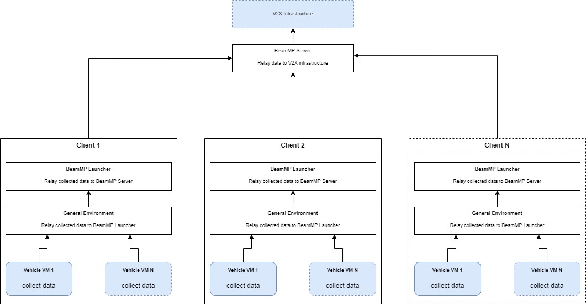
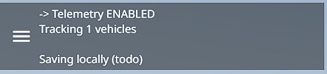

# BeamNG-Telemetry

## Motivation
This script was made as an alternate to [BeamNGPy](https://github.com/BeamNG/BeamNGpy) for vehicle telemetry collection __[in a multiplayer session](https://beammp.com)__. And just specifially for this case as multiplayer sessions are not officially supported on the python endpoint of [BeamNG.*tech*](https://beamng.tech).

## What is this?
<details>
<summary>This script collects vehicle Telemetry from all to a client local vehicles in a multiplayer session and sends it to the server where it is then stored away or if needed send further. (Click to open)</summary>


</details>

## Currently Collects the following data
- General vehicle config data, such as the vehicle name and id
- General vehicle data, such as the position and rotation
- General eletric values, such as what electric controllers can be found on the vehicle and if they are active and acting
- Input values, such as throttle and brake
- Wheel values, such as the in contact ground model (Asphalt, dirt), wheel speed, slip and various brakes data
- Energy values, such as the available fluid tanks and volumes (think of a gasoline fuel tank)

<details>
<summary>Example Readout (Click to open)</summary>

```json
{
  "_VERSION": 1,
  "config": {
    "config": "settings/default.pc",
    "id": 41675,
    "jbm": "etkc"
  },
  "electrics": {
    "absActive": false,
    "escActive": false,
    "hasAbs": true,
    "hasEsc": true,
    "hasTcs": true,
    "odometer": 226.2229014,
    "signalHazardActive": false,
    "signalLeftActive": false,
    "signalReverseActive": false,
    "signalRightActive": false,
    "tcsActive": false,
    "twoStepEnabled": false
  },
  "energy": {
    "mainTank": {
      "energyCapacity": 1556250000,
      "energyDensity": 41500000,
      "energyType": "gasoline",
      "fluidCapacity": 50,
      "leakRate": 0,
      "remainingEnergyCapacity": 1550578432,
      "remainingFluidCapacity": 49.81778095
    }
  },
  "gameVersion": "0.35.4.0.18091",
  "general": {
    "accel": 0.08223197677,
    "altToMsl": 224.323525,
    "altToSurface": 0.09737449605,
    "dir": {
      "x": 0.3599453568,
      "y": 0.9169647098,
      "z": -0.1720905304
    },
    "dirUp": {
      "x": 0.09386821836,
      "y": 0.1478624642,
      "z": 0.9845432043
    },
    "heading": 21,
    "pos": {
      "x": 937.226614,
      "y": 627.9459108,
      "z": 224.323525
    },
    "rot": {
      "w": -0.1866491735,
      "x": 0.03254408017,
      "y": 0.08172975481,
      "z": 0.9784801006
    },
    "vel": {
      "x": 1.031052828,
      "y": 10.31431293,
      "z": -2.010768175
    }
  },
  "inputs": {
    "brake": 0,
    "clutch": 0,
    "parkingBrake": 0,
    "steering": -0.526658696,
    "throttle": 1
  },
  "time": 15087,
  "wheels": {
    "FL": {
      "angularVelocity": -31.86182976,
      "brake": {
        "absActive": false,
        "absFrequency": 100,
        "brakeCoolingArea": 0.150529412,
        "brakeCoreEnergyCoef": 0.0002989000478,
        "brakeCoreTemperature": 286.3500758,
        "brakeDiameter": 0.37,
        "brakeMaterial": "carbon-ceramic",
        "brakeMeltingPoint": 1800,
        "brakeSpecHeat": 820,
        "brakeSurfaceEnergyCoef": 0.001693766938,
        "brakeSurfaceTemperature": 287.1362922,
        "brakeThermalEfficiency": 0.9819911854,
        "brakeTorque": 2800,
        "brakeType": "carbon-ceramic-vented-disc",
        "brakingTorque": 0
      },
      "contactMaterial": "DIRT_DUSTY",
      "contactMaterialID": 14,
      "downForce": 5914.234863,
      "hasTire": true,
      "hubRadius": 0.255,
      "isBroken": false,
      "isDeflated": false,
      "radius": 0.33,
      "slip": 2.767340422,
      "slipEnergy": 4870.25293,
      "treadCoef": 0.4,
      "wheelSpeed": 10.46989959
    },
    "FR": {
      "angularVelocity": 29.07282639,
      "brake": {
        "absActive": true,
        "absFrequency": 100,
        "brakeCoolingArea": 0.150529412,
        "brakeCoreEnergyCoef": 0.0002989000478,
        "brakeCoreTemperature": 274.1047585,
        "brakeDiameter": 0.37,
        "brakeMaterial": "carbon-ceramic",
        "brakeMeltingPoint": 1800,
        "brakeSpecHeat": 820,
        "brakeSurfaceEnergyCoef": 0.001693766938,
        "brakeSurfaceTemperature": 271.4348818,
        "brakeThermalEfficiency": 0.9758834237,
        "brakeTorque": 2800,
        "brakeType": "carbon-ceramic-vented-disc",
        "brakingTorque": 0
      },
      "contactMaterial": "DIRT_DUSTY",
      "contactMaterialID": 14,
      "downForce": 0.0002344078093,
      "hasTire": true,
      "hubRadius": 0.255,
      "isBroken": false,
      "isDeflated": false,
      "radius": 0.33,
      "slip": 1.508722663,
      "slipEnergy": 0.2433418781,
      "treadCoef": 0.4,
      "wheelSpeed": 9.625636369
    },
    "RL": {
      "angularVelocity": -47.3743515,
      "brake": {
        "absActive": false,
        "absFrequency": 100,
        "brakeCoolingArea": 0.130874823,
        "brakeCoreEnergyCoef": 0.0005518154729,
        "brakeCoreTemperature": 267.6956301,
        "brakeDiameter": 0.345,
        "brakeMaterial": "carbon-ceramic",
        "brakeMeltingPoint": 1800,
        "brakeSpecHeat": 820,
        "brakeSurfaceEnergyCoef": 0.003126954346,
        "brakeSurfaceTemperature": 259.0945702,
        "brakeThermalEfficiency": 0.9699556541,
        "brakeTorque": 1500,
        "brakeType": "carbon-ceramic-vented-disc",
        "brakingTorque": 0
      },
      "contactMaterial": "ASPHALT",
      "contactMaterialID": 10,
      "downForce": 1046.509155,
      "hasTire": true,
      "hubRadius": 0.255,
      "isBroken": false,
      "isDeflated": false,
      "radius": 0.33,
      "slip": 5.81640625,
      "slipEnergy": 8452.280273,
      "treadCoef": 0.4,
      "wheelSpeed": 15.60778231
    },
    "RR": {
      "angularVelocity": 44.74794006,
      "brake": {
        "absActive": false,
        "absFrequency": 100,
        "brakeCoolingArea": 0.130874823,
        "brakeCoreEnergyCoef": 0.0005518154729,
        "brakeCoreTemperature": 261.7592303,
        "brakeDiameter": 0.345,
        "brakeMaterial": "carbon-ceramic",
        "brakeMeltingPoint": 1800,
        "brakeSpecHeat": 820,
        "brakeSurfaceEnergyCoef": 0.003126954346,
        "brakeSurfaceTemperature": 253.4404388,
        "brakeThermalEfficiency": 0.9668522191,
        "brakeTorque": 1500,
        "brakeType": "carbon-ceramic-vented-disc",
        "brakingTorque": 0
      },
      "contactMaterial": "DIRT_DUSTY",
      "contactMaterialID": 14,
      "downForce": 7256.098633,
      "hasTire": true,
      "hubRadius": 0.255,
      "isBroken": false,
      "isDeflated": false,
      "radius": 0.33,
      "slip": 5.902441025,
      "slipEnergy": 25653.81445,
      "treadCoef": 0.4,
      "wheelSpeed": 14.76346935
    }
  }
}
```
</details>

Readout format
```
{Readout 1}\n{Readout 2}\n{Readout N}\n
```

At default the readout rate is attached to the graphics tick of the game. So 60 frames per second will lead to one readout every 16ms. This is alot of data. And you can change this and alot of other values in the [collection script](https://github.com/OfficialLambdax/BeamNG-Telemetry/blob/main/Client/telemetry/lua/vehicle/extensions/auto/Telemetry.lua) itself.

Exact unit describtions can currently only be found in the [collection script](https://github.com/OfficialLambdax/BeamNG-Telemetry/blob/main/Client/telemetry/lua/vehicle/extensions/auto/Telemetry.lua#L79) itself.

For parser versioning a `_VERSION` key is attached to the root of each readout.

## Installation Instructions
This assumes that you already have a BeamMP Server setup ([documentation](https://docs.beammp.com/server/create-a-server)) and the BeamMP Launcher installed on the same machine as BeamNG.*tech/drive* is installed ([documentation](https://docs.beammp.com/game/getting-started/#1-compatibility)).

1. Clone this repository or download a [clone as a zip](https://github.com/OfficialLambdax/BeamNG-Telemetry/archive/refs/heads/main.zip)
2. From the clone take the zip file in `Client/telemetry.zip` and move it into your BeamMP Server's `Resources/Client` folder. Final path would look like `Resources/Client/telemetry.zip` (This will ensure that all connecting clients to this server will autodownload this mod and activate it)
3. From the clone take the entire `Telemetry` folder in `Server/` and move it into your BeamMP Server's `Resources/Server` folder. Final path would look like `Resources/Server/Telemetry`, with a file called `main.lua` in it.
4. Done

Any changes to the client side mod require a restart of the server.

## How to use
If the installation has succeeded then you can from this point on see a UI on your screen that will let you know about if the Telemetry is collected or not.



By default the Telemetry is disabled. To activate it you have to configure a keybind in the controls of the game and press it. `Options -> Controls -> Telemetry -> Toggle Readouts`.

## Readout location
At default the Server side telemetry script that receives the telemetry from all clients stores them to files that can be found right next to your BeamMP Server's workfolder. `./readouts`. This path can be changed in the [Server side](https://github.com/OfficialLambdax/BeamNG-Telemetry/blob/main/Server/Telemetry/main.lua) script.
